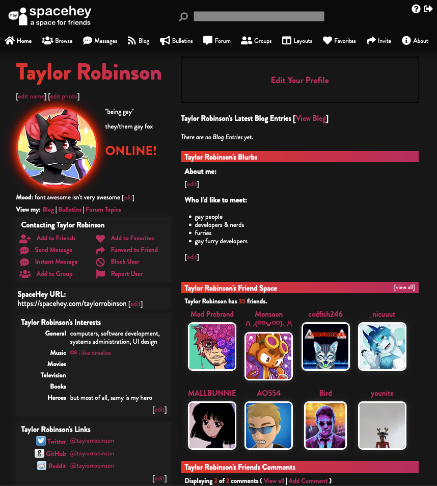
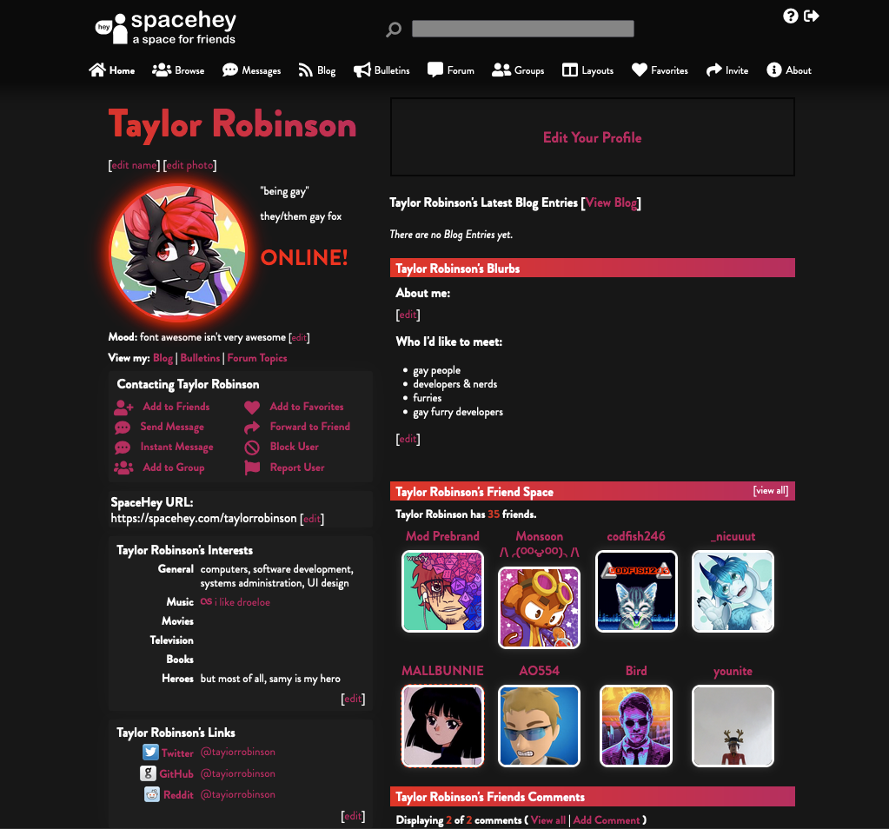
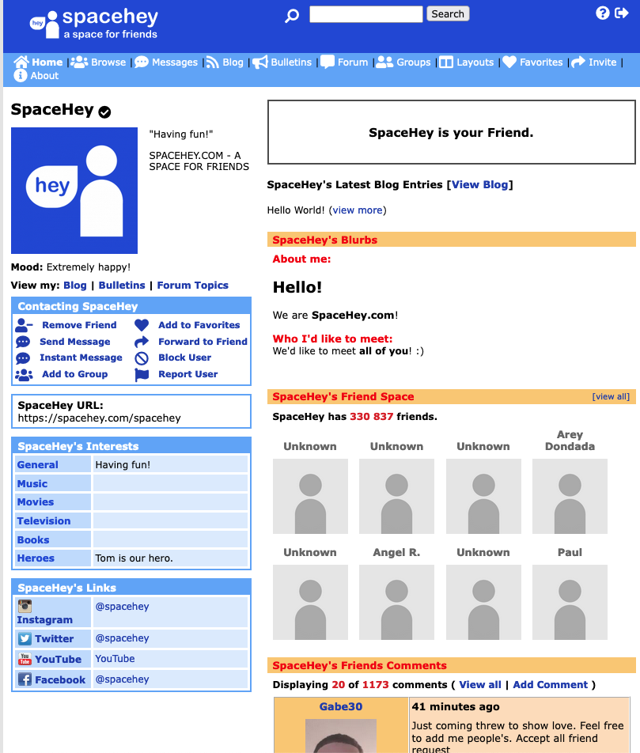
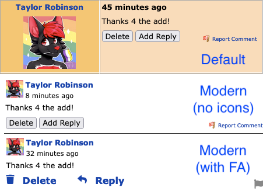
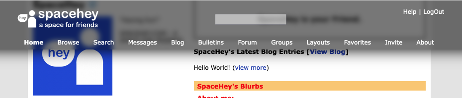
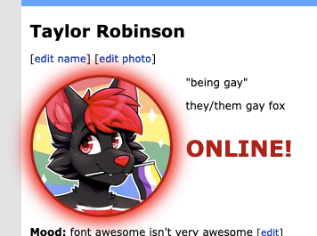

# spacehey
Various CSS tweaks &amp; themes for SpaceHey

 - `proxitaylor.scss` - My custom SpaceHey theme, It's Proxima with Added Bullshit™

    - `<style>@import url("https://robins.one/spacehey/build/proxitaylor.css");<style>`



 - `proxima/proxima.scss` (build/proxima.css) - Black and red theme for SpaceHey

    - `<style>@import url("https://robins.one/spacehey/build/proxima.css");<style>`



 - `addons/iconic.css` - Adds Font Awesome to SpaceHey, and that's it!
   - `<style>@import url("https://robins.one/spacehey/addons/iconic.css");<style>`


 - `addons/modern-comments.css` - Makes SpaceHey profile comments vertical instead of having a sidebar.
   - `<style>@import url("https://robins.one/spacehey/addons/modern-comments.css");<style>`


 - `addons/modern-navbar.css` - Makes the SpaceHey navbar look nicer.
   - `<style>@import url("https://robins.one/spacehey/addons/modern-navbar.css");<style>`


 - `addons/online-glow.css` - Adds an glow to your profile picture when you're online.
```html
<style>
@import url("https://robins.one/spacehey/addons/online-glow.css");
.online,.online:before {
    --onl_baseColor: #ff0321; /* Main color for glow */
    --onl_darkColor: #b30015; /* Dark color for glow */
    --onl_brightColor: #ff0000; /* Color for shadow of the glow */
    --onl_leftOffset: 0px; /* Adjust this to move it left/right */
    --onl_topOffset: 0px; /* Adjust this to move it up/down */
}
<style>
```
